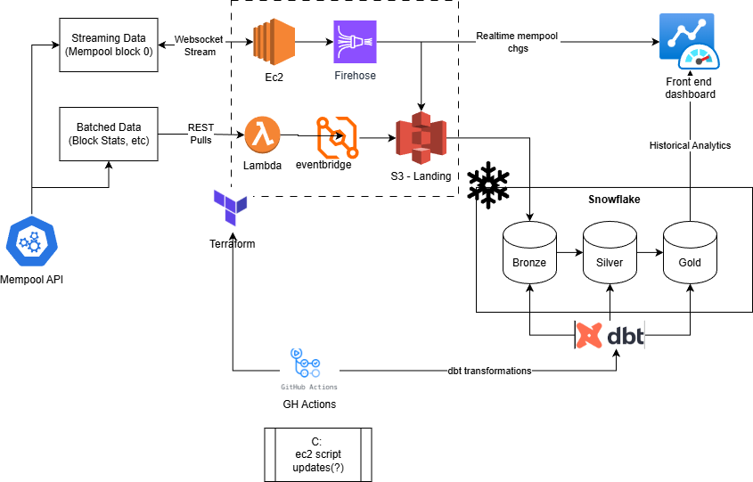

# Mempool data pipeline project:

- Pulls data from Mempool.space's API & WebSockets connection
- Event stream: transaction deltas for the next expected block
- Conversions stream: periodic BTC conversion rates
- Batch data: block metadata snapshots

## Requirements

### Goals

- Able to visualize 'next block' changes in realtime
- Visualize historical block data statistics
- Track periodic BTC conversion rates

### Architecture

- Orchestration - GitHub Actions
  - Terraform build/destroy - AWS
  - Ec2 start/stop listening
  - dbt transformations in Snowflake
- Data Source - mempool.space
  - Realtime via [websocket api](https://mempool.space/docs/api/websocket)
  - Batch via [REST API](https://mempool.space/docs/api/rest)
- AWS Infrastructure
  - Managed via Terraform. S3 must persist on destroy.
  - Event Streaming:
    - EC2: Python connection to mempool websocket to receive JSON data to Firehose
    - Firehose stream: writes to `s3://.../mempool-data/stream/`
    - Firehose conversions: writes to `s3://.../mempool-data/conversions/`
  - Batched Data:
    - EventBridge triggers Lambda function
    - Lambda polls mempool REST for block data -> `s3://.../batch/`
  - S3 stores raw data and state
  - IAM manages access among AWS resources
- Data Warehousing
  - Snowflake DW
  - Snowpipe auto-ingests stream + conversions into raw tables
  - dbt for transformations
- Front end (TBD - Streamlit?)

## Rough Architecture Diagram

